Student's diary 
=====================

#### A program for students from a student. This app can replace the student's diary function. 

#### Functions: Display notifications before the end or beginning of lessons and break time, record schedules, ratings, homework, annual assessments, teachers and the ability to create your own color themes of the application

#### Russian documentation is available

#### On development stage: In development: Help section for lessons - everyone can add their own hint, rule to a specific lesson. Hints will be available to all users; Holiday themes

#### The current version can be found at this link: https://drive.google.com/file/d/15Vwry-PYq06-DgNU9ffBtzA9qr3QKLKC/view?usp=sharing

Дневник
=====================

#### Программа для школьников от школьника. Это приложение способно заменить полноценный дневник.

#### Функции: Показ уведомлений до конца или начала уроков и перемены, запись расписания, оценок, домашнего задания, годовых оценок, учителей и возможность создавать свои цветовые темы приложения.

#### В разработке: Раздел помощи по предметам - каждый сможет добавить свою подсказку, правило к тому или иному предмету. Подсказки будут доступны всем пользователям приложения; Праздничные темы

#### Приложение можно скачать по этой ссылке: https://drive.google.com/file/d/15Vwry-PYq06-DgNU9ffBtzA9qr3QKLKC/view?usp=sharing

Документация
=====================

Блок "Расписание"
-----------------------------------

#### Самый главный блок, по его данным работает функция отправки уведомлений и блоки “Дневник”, “Оценки”.
#### В макете лежит `ViewPager`(Слайдер) с помощь которого происходит переключение между фрагментами дней, которые были сгенерированы в коде. По умолчанию включена суббота, которую можно выключить в настройках.

### **Функционал родительского экрана:** 
#### 1) Кнопка открытия меню блоков
#### 2) Кнопка включение, выключение уведомлений в текущем дне
#### 3) Список дней, белая полоса указывает на текущий день, нажатие на определенный день откроет соответствующий день, так-же переключение работает путём слайда
#### 4) Блоки с информацией о уроке, содержит: время начала и конца, само название предмета и номер кабинета, аудитории; короткое нажатие откроет меню редактирование, долгое нажатие выведет окно удаление. Если нет записей, то на заднем фоне будет отображаться подсказка
#### 5) Кнопка добавление новой записи, короткое нажатие открывает меню добавление(оно же меню редактирования), долгое нажатие выведет окно о очистке, где будет выбор: либо удалить все записи, либо только в текущем дне
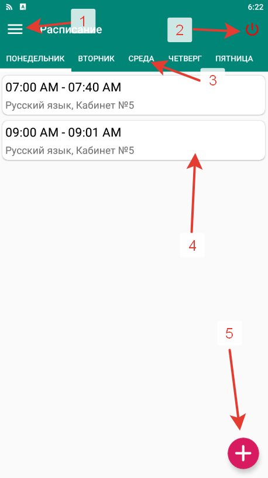

### **Функционал экрана добавление, он же экран редактирования:**
#### 1) Поле начала урока, принимает значение вида `ЧЧ:ММ` Временной промежуток урока. Если у вас стоит 12 часовой формат, справа от времени появятся AM/PM. Нажатие по этим полям откроет меню времени
#### 2) Поле названия урока
#### 3) Выбор место проведения, для школьников – кабинет, для студентов – аудитория
#### 4) Номер кабинета, аудитории
#### Если все поля были пусты (то есть вы ничего не вводили) запишутся данные по умолчанию, которые вы могли видеть в скрытом режиме
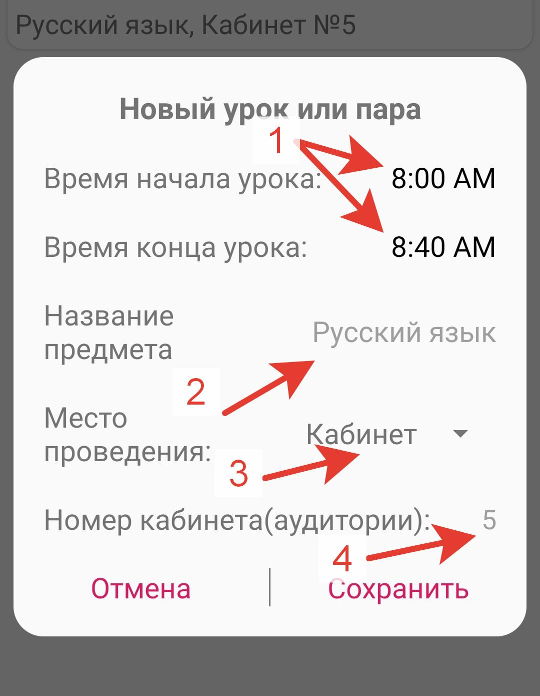

### **Функционал меню времени:**
#### Стандартный TimePicker. Снача выбираете часы, после минуты. 
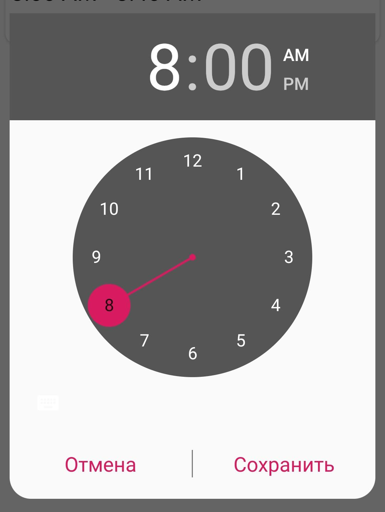

### **Функционал с программной точки зрения:**
#### При добавлении новых записей записывает в файлах `Monday.txt`, `Tuesday.txt` и так далее, информацию по шаблону: `ЧАС:МИНУТА:AM-ЧАС:МИНУТА:AM=НАЗВАНИЕ ПРЕДМЕТА=КАБИНЕТ/АУДИТОРИЯ НОМЕР /n`, если используется 24 часовой формат: `ЧАС:МИНУТА-ЧАС:МИНУТА=НАЗВАНИЕ ПРЕДМЕТА, КАБИНЕТ/АУДИТОРИЯ НОМЕР /n`. Сами файлы находятся в корневом каталоге приложения

Блок "Дневник"
-----------------------------------

#### Блок заменяющий основной функционал дневника
#### В макете также лежит `ViewPager`, с помощью которого происходит перемещение между днями недели, которые были тоже сгенерированы в коде

### **Функционал родительского экрана:**
#### 1) Кнопка открытия меню блоков
#### 2) Текстовое поле выводящие дату начала и конец недели(включая воскресение). Нажатие по нему откроет окно удаление, можно либо удалить записи домашнего задания, либо оценки, либо полностью очистить текущую неделю(расписание уроков будет сгенерировано заново)
#### 3) Кнопка открывающая прошлую неделю, если она ещё не была создана, то она сгенерируется
#### 4) Кнопка открывающая следующую неделю, если она ещё не была создана, то она сгенерируется
#### 5) Добавление домашнего задания
#### 6) Добавление оценки за урок
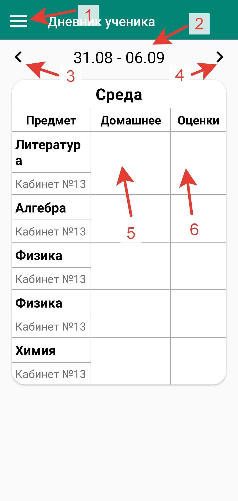

### **Функционал с программной точки зрения:**
#### При старте генерируется неделя и записывается в 6 файлов с названием типа: `ДЕНЬ.МЕСЯЦ.ГОД`(17.2.2020), эти файлы находятся в папке `Dnewnik`, она в свою очередь в корневом каталоге приложения. При генерации читаются файлы `Monday.txt`, `Tuesday.txt` и так далее, из них берется информация после знака равно, то есть: `НАЗВАНИЕ ПРЕДМЕТА, КАБИНЕТ/АУДИТОРИЯ НОМЕР= =`. Если файлы были не найдены или пусты неделя не генерируется, но в блоки дней выводится подсказка о добавлении расписания через блок “Расписание”. Неделя записывается по шаблону: `НАЗВАНИЕ ПРЕДМЕТА=КАБИНЕТ/АУДИТОРИЯ НОМЕР=ДОМАШНЕЕ ЗАДАНИЕ/*/=ОЦЕНКА /n`.Символы `/*/` необходимы для записи домашнего задания в несколько строк, каждый такой символ указывает на один перенос строки.
#### При нажатии на кнопки 3, 4 принцип тот-же, берется информация о том какая неделя сейчас отображается и просто добавляется или убавляется 7 дней

Блок "Учителя"
-----------------------------------
#### Блок содержащий имена учителей. Один учитель и предмет могут упоминаться несколько раз
#### В макете лежит список `RecyclerView` который содержит информацию о учителях, преподавателях

### **Функционал родительского экрана:**
#### 1) Кнопка открытия меню блоков
#### 2) Блоки с информацией о учителе, содержит: имя учителя, преподавателя и предмет который он ведет; короткое нажатие откроет меню редактирование, долгое нажатие выведет окно удаление. Если нет записей, то на заднем фоне будет отображаться подсказка
#### 3) Кнопка добавление нового учителя, короткое нажатие открывает меню добавление(оно же меню редактирования), долгое нажатие выведет окно о удаление списка учителей
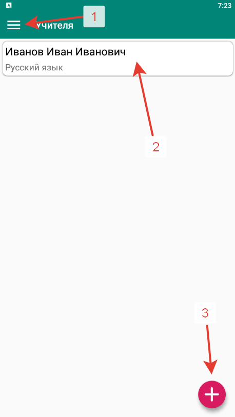

### **Функционал экрана добавление, он же экран редактирования:**
#### 1) Поле имени учителя, преподавателя
#### 2) Поле названия предмета которое он преподаёт 
#### Если все поля были пусты (то есть вы ничего не вводили) запишутся данные по умолчанию, которые вы могли видеть в скрытом режиме
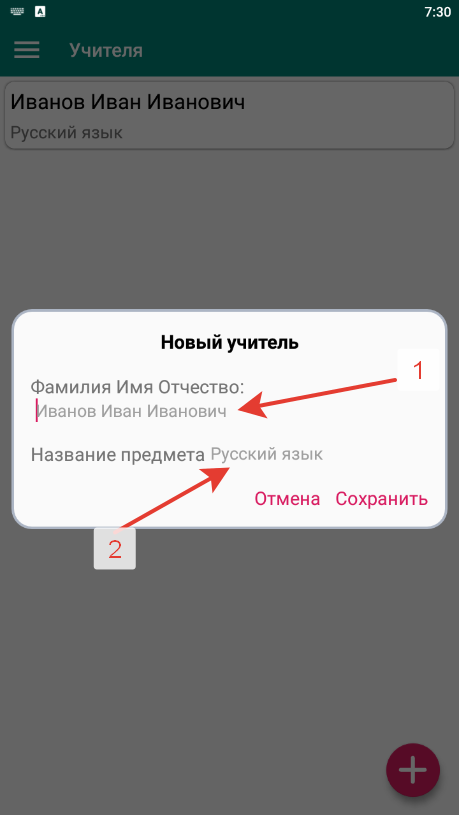

### **Функционал с программной точки зрения:**
#### При нажатие на кнопку добавление, записываются данные в файл `Ychitelia.txt` по шаблону: `ИМЯ УЧИТЕЛЯ, ПРЕПОДАВАТЕЛЯ=НАЗВАНИЕ ПРЕДМЕТА /n` и добавляется новый блок в `RecyclerView`

Блок "Оценки"
-----------------------------------
#### Блок, содержащий четвертные, годовые, экзаменационные и итоговые оценки
#### В основе лежит та же структура, что и в блоке "Дневник"
#### При первом запуске этого фрагмента выведется окно выбора месяца начала обучения и колличества четвертей(Для других стран), они будут использоваться для генерации учебных годов. Значение по умолчанию сетябрь и 4 четверти, это можно будет всегда изменить в настройках.
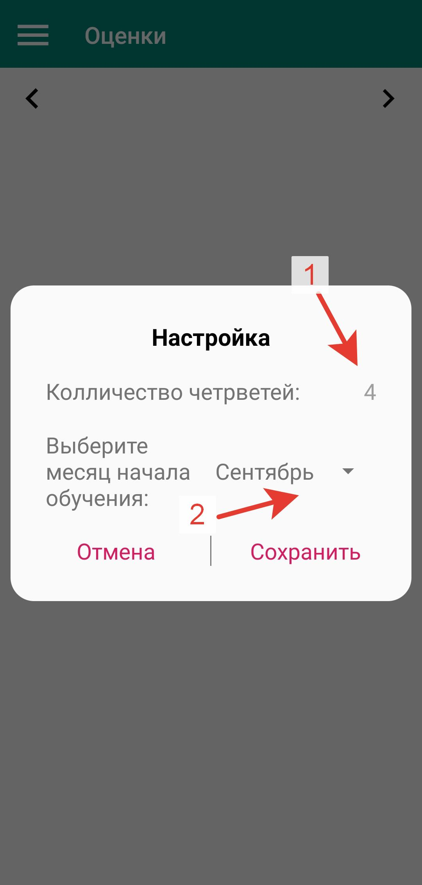

#### Также присутствует поле “Поведение”, которое можно отключить в настройках

### **Функционал родительского экрана:**
#### 1) Кнопка открытия меню блоков
#### 2) Текстовое поле выводящие дату начала и конца учебного года. Нажатие по нему откроет окно очистки, очистка будет возможно в случае, если вы ещё не подтверждали оценки
#### 3) Кнопка открывающая прошлый год, если он ещё не был создан, то он сгенерируется
#### 4) Кнопка открывающая следующий год, если он ещё не был создан, то он сгенерируется
#### 5) Поле оценок, при клике на пустую ячейку открывается клавиатура добавления оценок, по нажатие на кнопку “окей” на клавиатуре, оценка сохраняется
#### 6) Поле подтверждения, при клике на него открывается меню добавление подтверждения, если оно уже было добавлено, откроется один из способов подтверждения
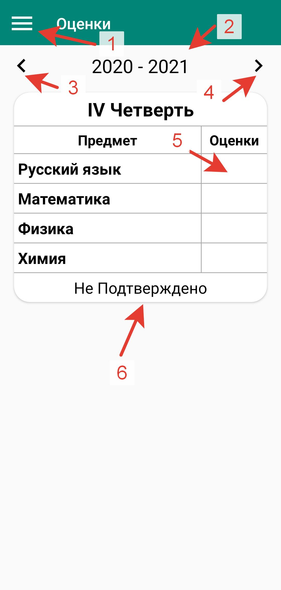

### **Функционал меню добавления:**
#### 1) Кнопка записи голоса учителя для подтверждения оценок, по нажатие открывается меню записи
#### 2) Кнопка открывающая камеру для подтверждения оценок, путём фотографии оценок или просто росписи учителя
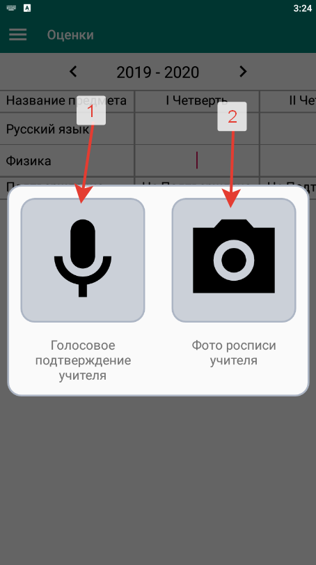

### **Функционал меню записи:**
#### 1) Кнопка начинающая запись, запись может длиться максимум 59 минут 59 секунд.При начатой записи она будет выполнять функцию паузы (Временно не поддерживается на устройствах ниже Android 7)
#### 2) Кнопка завершающая запись голоса 
#### 3) Поле показывающее сколько уже идет запись 
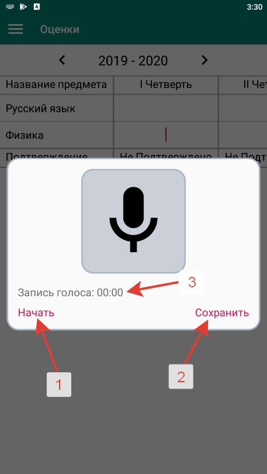

### **Функционал экрана подтверждения с помощью записи голоса:**
#### 1) Полоса плеера, используется для показа сколько было воспроизведено и в качестве инструмента для перемотки
#### 2) Поле показывающее текущую временную позицию
#### 3) Поле показывающее длительность записи
#### 4) Кнопка плей, пауза
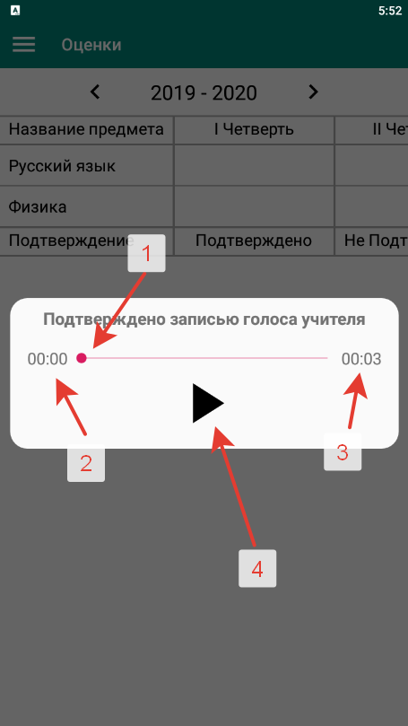

### **Функционал экрана подтверждения с помощью фотографии:**
#### 1) Сама фотография
#### 2) Кнопка закрытия диалога
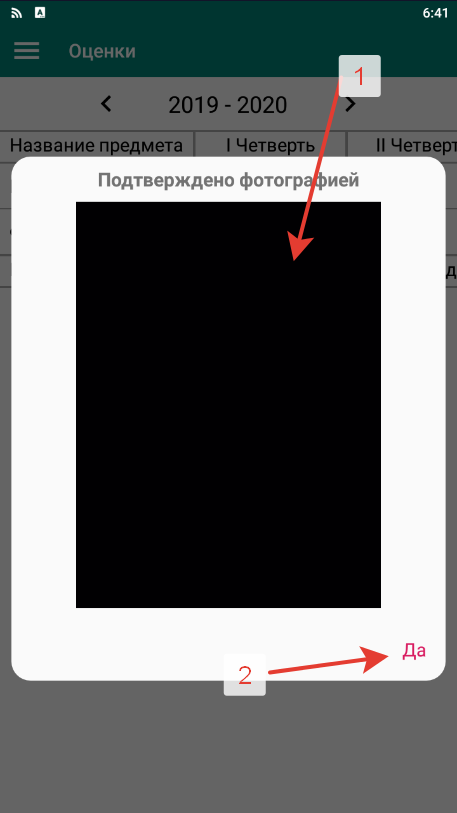

### **Функционал с программной точки зрения:**
#### Читаются файлы: `Monday.txt`, `Tuesday.txt` и так далее, из них  берутся предметы, если предмет уже был записан то он пропускается. Получившийся список записывается в файл `ГОД НАЧАЛА ОБУЧЕНИЕ – ГОД КОНЦА ОБУЧЕНИЯ` в папке `Ocenki`, находящейся в директории приложения, по шаблону `НАЗВАНИЕ ПРЕДМЕТА=ОЦЕНКА ЗА 1 ЧЕТВЕРТЬ=ОЦЕНКА ЗА 2 ЧЕТВЕРТЬ=ОЦЕНКА ЗА 3 ЧЕТВЕРТЬ=ОЦЕНКА ЗА 4 ЧЕТВЕРТЬ=ГОДОВАЯ ОЦЕНКА=ЭКЗАМЕНАЦИОННАЯ ОЦЕНКА=ИТОГОВАЯ ОЦЕНКА /n`

Блок "Справка"
-----------------------------------
#### Блок содержащий информацию о приложении и важные ссылки

### **Функционал главного экрана:**
#### 1) Ссылка на [GitHub](https://github.com/kos234/Student-s-diary)
#### 2) [Помощь в переводе приложения](https://www.transifex.com/students-diary/students-diary)
#### 3) Рабочая почта
#### 4) Ссылка на [Вконтакте автора](https://vk.com/i_love_python_and_you)
#### 5) [Что делать, если уведомления перестают работать через время](notifications.md)
#### 6) Кнопка открытия меню ошибок
#### 7) [Поддержать автора](https://donate.qiwi.com/payin/kos)
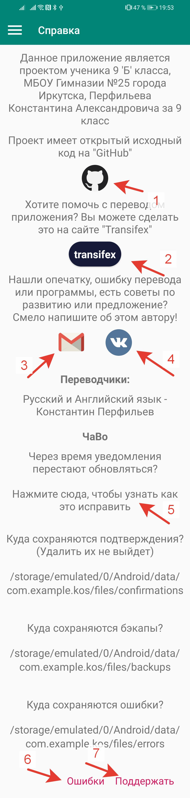

### **Функционал экрана меню ошибок:**
#### 1) Кнопка переключения на предыдущую ошибку
#### 2) Кнопка переключения на следующую ошибку
#### 3) Дата и время ошибки
#### 4) Лог ошибки(Если вы не разбираетесь в java программировании можете даже не пытаться понять что там написано)
#### Файлы ошибок расположены по пути /storage/emulated/0/Android/data/com.example.kos/files/errors в текстовом формате
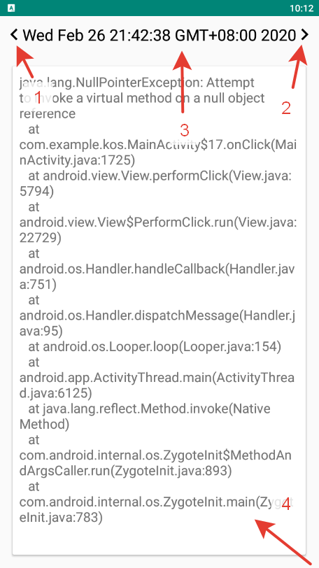

### **Функционал с программной части** – отсутствует, единственное что в нем есть, это поддержка своих тем, всё, что есть на экране, закреплено в макете, меню ошибок работает из главной активности

Блок "Настройки"
-----------------------------------
#### Блок содержащий настройки 

### **Функционал родительского экрана:**
#### 1) Настраивает расстояние между блоками дней в блоке “Дневник”(Пример - 1)
#### 2) Включает или Выключает уведомления о конце, начале урока или перемены
#### 3) Включает или выключает субботу в блоке “Расписание”
#### 4) Изменение месяца начала обучения
#### 5) Количество четвертей
#### 6) Включает или выключает поле “Поведение” в блоке “Оценки” (Внимание! Если учебный год уже был сгенерирован, то отключение этого параметра не уберет это поле из этого учебного года!)
#### 7) Добавляет или удаляет экзаменнационную оценку
#### 8) Добавляет или удаляет годовую оценку
#### 9) Добавляет или удаляет итоговую оценку
#### 10) Способ указания цвета в создании своей темы, по умолчанию возможен выбор (более подробно это описано в “Функционале экрана добавления тем”)
#### 11)  
#### 12) Включает или выключает анимации в приложении
#### 13) Убирает отступы от панели навигации(снизу)
#### 14) Включает выключает обводку диалогов (Пример - 2)
#### 15) Выбор фрагмента который будет включен при запуски приложения, по умолчанию запускается последний выбранный фрагмент
#### 16) Ширина обводки диалогов
#### 17) Очистка данных в блоке "Дневник ученика"(Удаляются всё записи/недели дневника и настройки связанные с этим блоком)
#### 18) Очистка данных в блоке "Распиание" (Удаляется всё расписание и настройки связанные с этим блоком, записи из блока "Дневник ученика" остаются без изменения)
#### 19) Очистка данных в блоке "Учителя" (Удаляются всё записи о учителях)
#### 20) Очистка данных в блоке "Оценки" (Удаляются всё записи о оценках и настройки связанные с этим блоком)
#### 21) Очистка данных в блоке "Настройки" (Удаляются всё настройки и сгенерированные темы)
#### 22) Очистка данных в блоке "Справка" (Удаляются всё отчеты о ошибках)
#### 23) Ипортирование данных. Открывает меню импортирования
#### 24) Экспортировать данные
#### 25) Включение уже установленной светлой цветовой темы, она используется как цветовая тема по умолчанию
#### 26) Включение уже установленной темной цветовой темы
#### 27) Поле с вашей темой (Их может быть сколько угодно), переключатель справа включает эту цветовую тему, нажатие по этому блоку открывает меню редактирования, свайп справа налево показывает кнопку удаления
#### 21) Кнопка создания своей цветовой темы(по умолчанию цвета для основы будут те же, что и в текущей теме)

### **Примеры:**
#### 1)
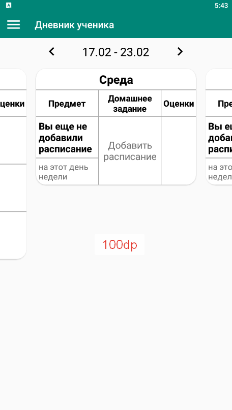
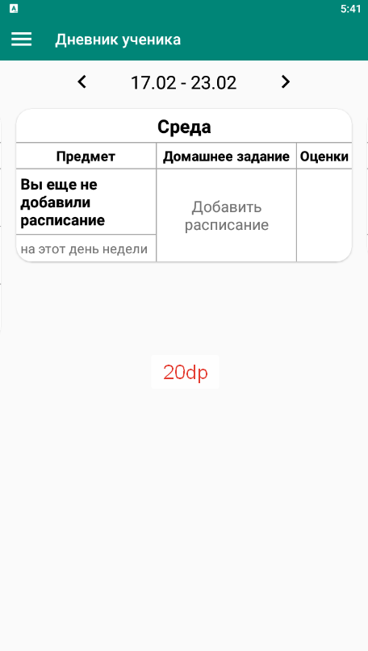

#### 2)
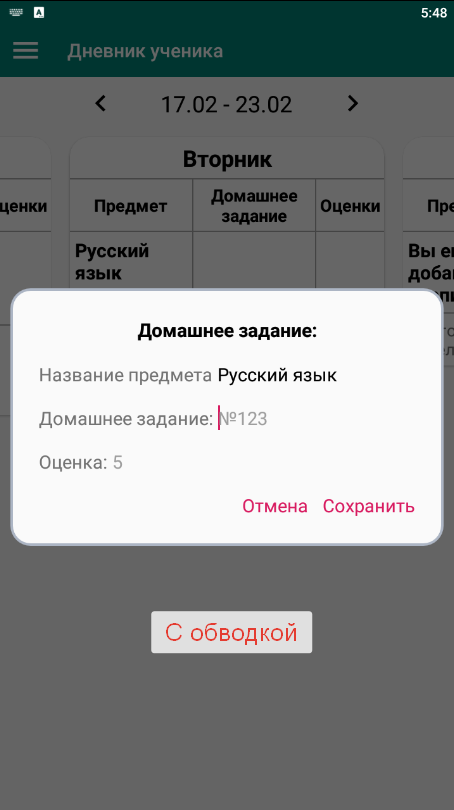
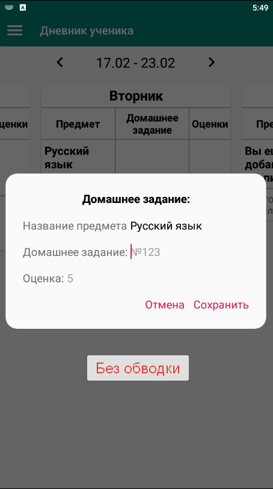

### **Меню выбора файла**
#### 1) Перемещение по папкам
#### 2) Выбор архива. Вы должны выбрать именно архив с данными
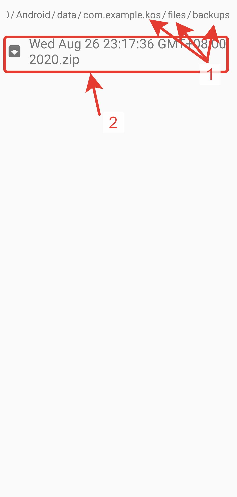

### **Функционал экрана создания тем, он же экран редактирования:**
#### 1) Кнопка сохранения цветовой темы
#### 2) Название темы
#### 3) Цвет иконки темы (Используется только для иконки темы в родительском экране)
#### 4) Цвет обводки иконки темы (Используется только для обводки иконки темы в родительском экране)
#### 5) Цвет заднего фона (Используется как задний фон приложения и задний фон диалогов)
#### 6) Цвет панели (Используется как цвет верхней панели с названием блока и экрана загрузки)
#### 7) Цвет текста панели (Используется как цвет текста и кнопки меню на панели с названием блоков, а так же как цвет текста экрана загрузки)
#### 8) Цвет панели уведомлений (Используется только для цвета панели уведомлений)
#### 9) Цвет светлого текста (Используется только как цвет светлого текста)
#### 10) Цвет тёмного текста (Используется только как цвет тёмного текста)
#### 11) Цвет текста подсказки (Используется только как цвет текста подсказки поля редактирования)
#### 12) Цвет курсора (Используется только как цвет курсора поля редактирования)
#### 13) Цвет блоков (Используется только как цвет блоков)
#### 14) Цвет нижней границы (Используется только как цвет границы между настройками в блоке “Настройки”)
#### 15) Цвет кнопки добавления (Используется как цвет кнопки в блоках “Учителя”, “Расписания”, и цвет кнопок диалогов)
#### 16) Цвет плюса кнопки добавления (Используется только как цвет плюса кнопки в блоках “Учителя” “Расписания”)
#### 17) Цвет стрелок и кнопок меню фрагментов (Используется как цвет стрелок и текста даты учебного года и недели в блоках “Дневник”, “Оценки” и как цвет текста и иконок в меню фрагментов)
#### 18) Цвет выбранного блока в меню
#### 19) Цвет иконки загрузки (Используется как цвет кружка загрузки в блоках “Дневник”, “Оценки”, начального экрана и диалога загрузки при создании и смене цветовой темы)
#### 20) Цвет неподтвержденных колонок таблиц (Используется только как цвет неподтвержденных колонок таблиц)
#### 21) Цвет колонок таблиц (Используется как цвет колонок таблицы в блоках “Дневник”, “Оценки”)
#### 22) Цвет иконки включенных уведомлений (Используется только как цвет иконки включенных уведомлений)
#### 23) Цвет выключенных иконки включенных уведомлений (Используется только как цвет выключенных иконки включенных уведомлений)
#### 24) Цвет включенного переключателя (Используется только как цвет включенного переключателя в настройках)
#### 25) Цвет выключенного переключателя (Используется только как цвет выключенного переключателя в настройках)
#### 26) Цвет фона блока выборов (Используется как цвет фона блоков выборов подтверждения и выбора способа указания цвета)
#### 27) Цвет границы блока выборов и диалогов (Используется как цвет границы блоков выборов подтверждения и выбора способа указания цвета и диалогов)
#### 28) Цвет аудио плеера (Используется только как цвет аудиоплеера)
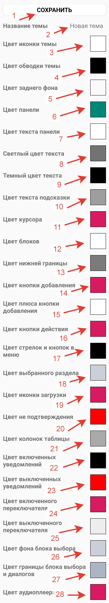

### **При нажатие на блоки с 3 по 27 открывается блок выбора способа указания цвета, вот его функционал:**
#### 1) Указать HEX-код 
#### 2) Выбрать цвет самому
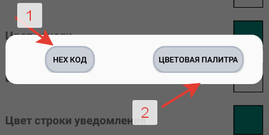

#### Если была нажата 1 кнопка, откроется меню:
#### 1) Поле для HEX-кода
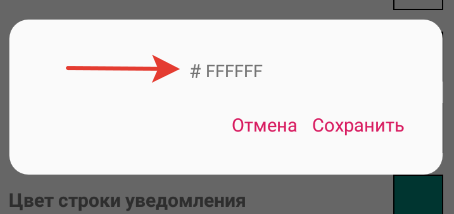

#### Если была нажата 2 кнопка, откроется меню:
#### 1) Выбор спектра цвета
#### 2) Выбор цвета из спектра
#### 3) Предыдущий цвет
#### 4) Итоговый цвет
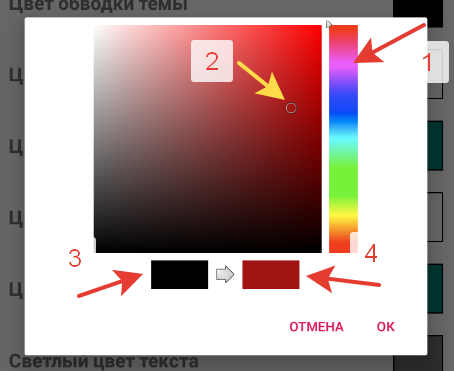

### **Функционал с программной точки зрения:**
#### Записывает настройки в `SharedPreferencess`(Массив данных с индексами) с названием `Settings`, при добавление цветовых тем, генерируется уникальный айди переключателя для блока с темами и идет запись цветовых значений в файл `Themes.txt` по шаблону `СГЕНЕРИРОВАННЫЙ АЙДИ ПЕРЕКЛЮЧАТЕЛЯ ДЛЯ БЛОКА =НАЗВАНИЕ ТЕМЫ=ПУНКТ 3= ПУНКТ 4 … ПУНКТ 27` и в `SharedPreferencess` файл с названием `Current_theme` записываются цветовые значения текущей темы для удобного получения значений из кода.

### **License/Лицензия**
    Copyright 2020 Kos

    Licensed under the Apache License, Version 2.0 (the "License");
    you may not use this file except in compliance with the License.
    You may obtain a copy of the License at

        http://www.apache.org/licenses/LICENSE-2.0

    Unless required by applicable law or agreed to in writing, software
    distributed under the License is distributed on an "AS IS" BASIS,
    WITHOUT WARRANTIES OR CONDITIONS OF ANY KIND, either express or implied.
    See the License for the specific language governing permissions and
    limitations under the License`
